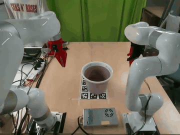
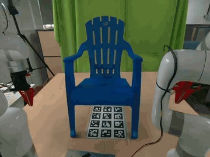
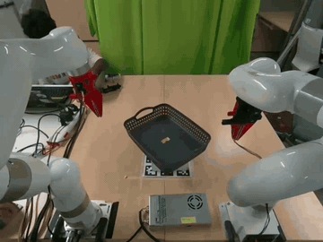

# Dual Arm Real Life Setup

This repository contains modular controllers and test scripts for a real-world robotic pipeline involving an xArm7 and an xArm6, Dynamixel Grippers, RealSense RGB-D cameras, and remote SAM segmentation.

<div style="display:flex; gap:12px; flex-wrap:wrap; justify-content:center;">
  
  
  
</div>

<!-- 
## Project Structure

- **`generation/`**: Perception &amp; grasp-generation pipeline (runs offline, no robot needed).
  - `pipeline.py`: End-to-end capture -> SAM -> pointcloud -> grasp model.
  - `pointcloud.py`: Masked depth deprojection and world-frame transform.
  - `aruco.py`: ArUco board marker poses (camera -> world).
  - `selection.py`: Interactive point/box SAM-prompt UI.
  - `visualization.py`: Open3D grasp rendering with the gripper mesh.
- **`execution/`**: Robot execution pipeline.
  - `pipeline.py`: Loads a run, builds arm poses, runs the grasp primitive.
  - `motion.py`: Threaded dual-arm moves, table-collision checks, grasp primitive.
  - `transforms.py`: Model <-> board <-> arm-base frame transforms.
  - `config.py`: Arm IPs, gripper and motion tunables.
  - `visualization.py`, `recording.py`: Scene visualization and optional RealSense recording.
- **`scripts/`**: Thin entry points - `generation.py` and `execution.py`.
- **`xarm/`**: xArm7 control and simulation.
  - `src/xarm_controller.py`: Main class for hardware interaction.
  - `src/xarm_sim.py`: PyBullet-based simulation for IK and trajectory visualization.
  - `xarm_test.py`, `dual_arm_test.py`, `grasp_test.py`: Arm test scripts.
- **`gripper/`**: Dynamixel gripper control.
  - `src/gripper_controller.py`: Controller class for single/dual gripper setups.
  - `gripper.obj`: Gripper visualization/collision mesh.
  - `dual_gripper_test.py`, `gripper_test.py`: Interactive toggle tests.
- **`realsense/`**: Intel RealSense capture (with optional FFS depth).
  - `src/realsense_camera.py`: RGB-D frame acquisition, alignment, and ArUco detection.
  - `realsense_test.py`, `realsense_aruco_test.py`: Live viewer and ArUco tests.
- **`client/`**: Remote inference clients.
  - `src/sam.py`: Client for remote SAM (Segment Anything Model) inference.
  - `src/model.py`: NPZ-based client for the grasp model server.
  - `src/ffs.py`: Client for the Fast Foundation Stereo depth server.
  - `webcam_sam_test.py`, `model_predict_test.py`, `ffs_test.py`: Per-client test scripts.
- **`server/`**: Server-side test harnesses for the SAM, grasp-model, and FFS services.
- **`urdf/`**: Robot, gripper, and scene URDFs/meshes for simulation. -->

## Hardware & 3D Printing

The gripper used in this project consists of custom 3D printed parts designed for Dynamixel X-series motors.

### Printing Instructions
The STL files are located in `gripper/3d_printed_parts/`. For a complete gripper, you need to print:
- **Base** (`base.stl`): The main chassis that mounts to the motor.
- **Gear** (`gear.stl`): The internal drive gear.
- **Left Tip** (`left_tip.stl`): The left-side finger.
- **Right Tip** (`right_tip.stl`): The right-side finger.
- **Cover** (`cover.stl` or `cover.3mf`): The protective housing.

## Setup Instructions

### Prerequisites
- Python 3.10+
- [uv](https://github.com/astral-sh/uv) (recommended for package management)

### Installation
1. Clone the repository and navigate to the root:
   ```bash
   git clone https://github.com/wig-nesh/dual-arm-setup-RRC.git
   cd dual-arm-setup-RRC
   ```

2. Create environment and install dependencies:
   ```bash
   uv sync
   ```

## Usage

### Full Pipeline
The end-to-end pipeline is split into two stages, each run via a thin entry point in `scripts/`.

1. **Grasp generation** - capture RGB-D, segment with SAM, build a pointcloud, and query the grasp-model server. Results are saved under `run_data/<timestamp>/`.
   ```bash
   uv run scripts/generation.py \
     --sam-url http://dualarm@orion.rrcx.tk:8000 \
     --model-url http://localhost:8000 \
     [--ffs-url http://<ffs-host>:<port>]
   ```
   Omit `--ffs-url` to use the RealSense's native depth.

2. **Grasp execution** - load a run, build per-arm poses, and execute the grasp on both xArms.
   ```bash
   uv run scripts/execution.py --run-dir run_data/<timestamp> [--direct] [--grasp-idx 0]
   ```
   Flags: `--direct` (skip manual jog), `--grasp-idx N`, `--dry-run`, `--record-realsense`, `--manual-xyzrpy`.

### Hardware Tests

#### xArm Control
Run the single arm test with PyBullet visualization:
```bash
uv run xarm/xarm_test.py
```
Run the dual arm simultaneous movement test (no PyBullet yet):
```bash
uv run xarm/dual_arm_test.py
```

#### Gripper Control
Test the dual gripper setup (Left: ID 0, Right: ID 1):
```bash
uv run gripper/dual_gripper_test.py
```
- `L`: Toggle Left
- `R`: Toggle Right

#### RealSense Capture
Capture RGB-D data to the `data/` folder:
```bash
uv run realsense/realsense_test.py
```
- `SPACE`: Capture Frame
- `Q`: Quit

#### SAM Client Test
Run interactive segmentation on your webcam feed:
```bash
uv run client/webcam_sam_test.py --url http://dualarm@orion.rrcx.tk:8000
```
- `Left Click`: Select point to segment.
- `Q`: Quit.

#### Grasp Model Client Test
To run the Grasp Model client, first setup SSH Port Forwarding in a separate terminal:
```bash
ssh -L 8000:gnode117:8000 ayushk02@ada.iiit.ac.in
```
Then, run the prediction test with interactive Open3D visualization:
```bash
uv run client/model_predict_test.py --url http://localhost:8000
```

## Data Storage
Each generation run writes to its own timestamped folder under `run_data/` (git-ignored):
- `rgb.png`, `depth.npy`, `intrinsics.json` - raw capture and camera calibration.
- `sam_mask.png` / `sam_mask_vis.png` - SAM segmentation mask.
- `pcd_scaled.ply` - processed, scaled pointcloud sent to the model.
- `marker_transform.npy` - camera-to-world ArUco transform (if markers were detected).
- `grasps.npz` - grasp pairs and scores returned by the model server (consumed by `scripts/execution.py`).
